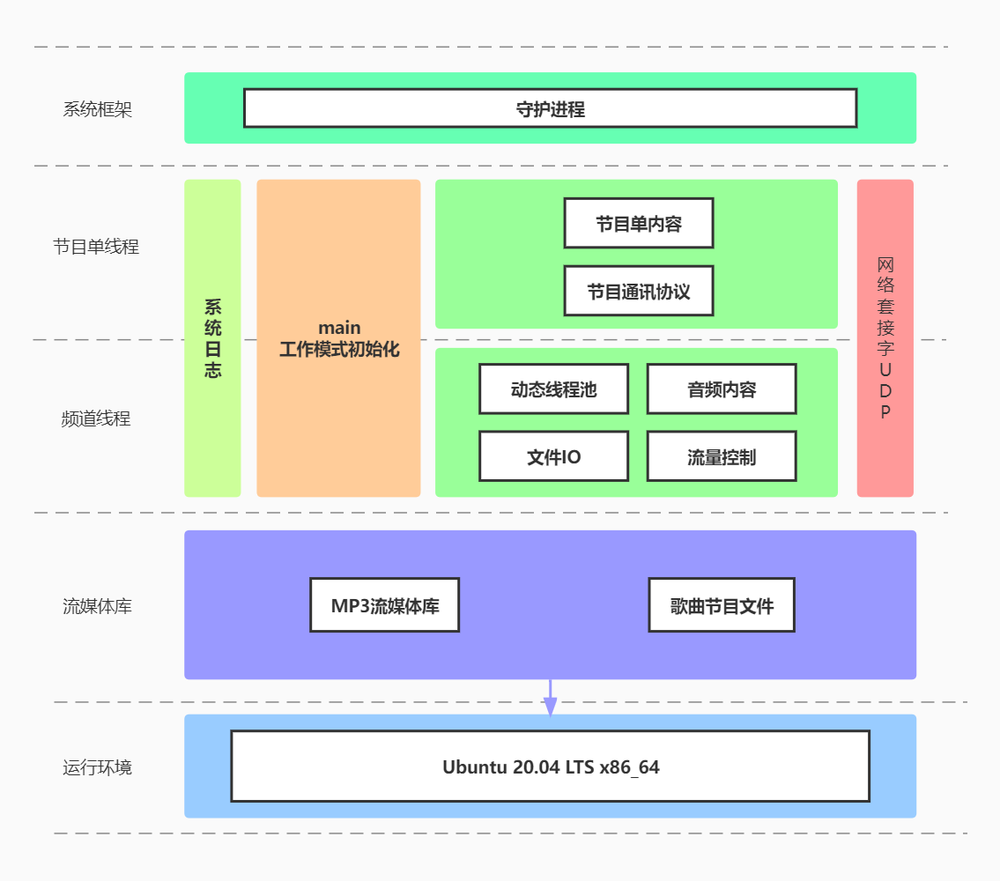
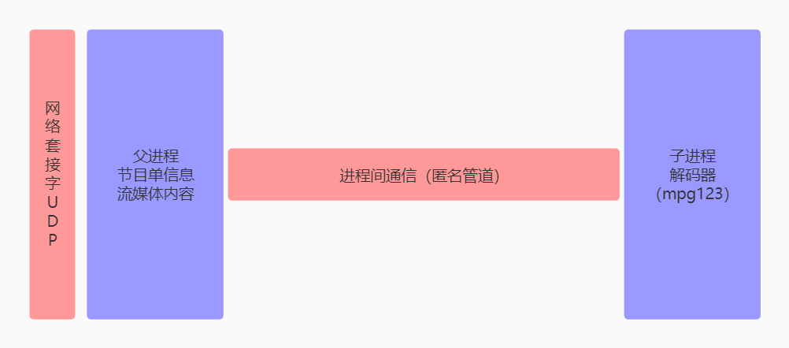

# CLIENT_SERVER_4MEDIA

# 基于IPv4的流媒体广播系统

Streaming media broadcasting system based on IPv4. It is written in C language and uses advanced unix programming technology.

## 项目简介

**基于IPv4的流媒体广播系统**，在原版的基础上进行升级和bug修复等。采用C语言编写，使用高级Unix环境编程技术。基于**客户端/服务器模型（C/S）**开发，运行于**Linux**平台。服务端可以运行在个人PC或小型服务器上，客户端可以运行在个人PC或者ARM便携设备。服务端作为**守护进程**运行在后台，启动后会读取本地的媒体库信息，生成所有的**节目描述信息**，并采用**UDP组播**的形式发送给所有加入该组播组的设备，同时读取本地媒体库中的歌曲二进制内容，形成**相应频道包**，向局域网内每个设备发送MP3格式的流媒体音乐。服务器端采用**动态线程池**技术处理节目描述信息发送以及频道内容发送的并发任务，流媒体发送时的流量控制采用**令牌桶**流控技术；客户端采用**多进程**，父进程负责从网络接收频道信息和歌曲内容的数据，通过**进程间通信**技术（例如：管道）发送给子进程，子进程使用解码器（mpg123）对收到的流媒体音乐进行解码并使用扬声器播放。采用系统日志记录运行时产生的log信息。

## 需求分析

- 客户端分为数据接收和数据解码两个较为独立的功能，采用多进程方式实现，进程间通信采用匿名管道实现。
- 广播系统，服务端与客户端采用面向无连接的UDP协议，最实用的实现方式是使用UDP组播技术，相比广播更加节省局域网资源。
- 由于服务端需要多个任务并发执行，首先想到多线程处理，考虑后期功能升级，决定采用动态线程池，由线程池来管理各线程的申请和资源释放。
- UDP是面向无连接的协议，也没有流量控制。为了让客户端能正常收到所有的歌曲内容，不严重丢帧，需要手动实现流控算法，这里采用令牌桶流控。
- 客户端需要知道广播都有什么节目和内容，因此服务端需要一个不停发送节目单信息的频道。
- 服务端需要同时广播n个频道的内容，因此需要实现多线程并发。
- 以守护进程模式运行时需要使用系统日志，方便查看崩溃记录和DEGUB信息。

## 系统框架



																										服务端框架

------



																											客户端框架

## 目录结构

```
├── client
│   ├── bin
│   │   ├── client
│   │   └── client.o
│   ├── client.c
│   ├── client.h
│   └── Makefile
├── include
│   ├── proto.h
│   └── site_type.h
└── server
    ├── bin
    ├── Makefile
    ├── medialib.c
    ├── medialib.h
    ├── mytbf.c
    ├── mytbf.h
    ├── server.c
    ├── server_conf.h
    ├── thr_channel.c
    ├── thr_channel.h
    ├── thr_list.c
    └── thr_list.h
```


## 部署

```shell
$ cd server/
$ make
$ ./server -R 0  # 守护进程运行
$ cd ../client/
$ make
$ ./start.sh  # 启动客户端，为防止丢帧，首次启动务必使用此脚本
```


## 技术栈

> 高级Unix环境编程

- 文件IO

- 进程

- 进程间通信

- 守护进程

- 信号

- 线程

- 网络编程(socket)

- UDP